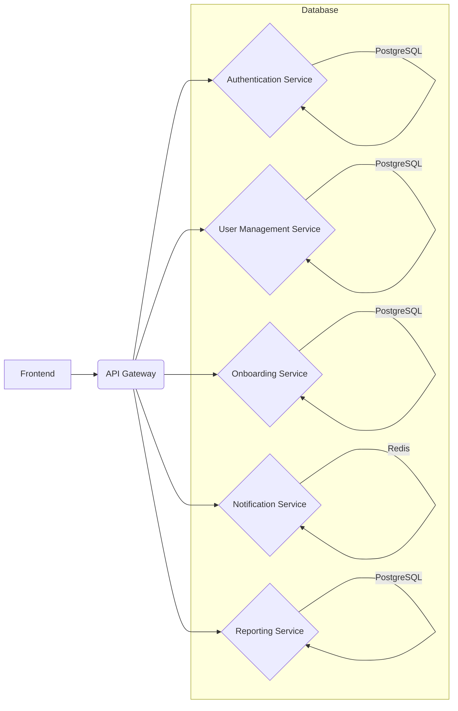

# Бэкенд_разработка

## Раздел: Бэкенд_разработка – Butterboard

**Версия:** 1.0
**Дата обновления:** 2023-10-27
**Автор:** Александр Петров, Главный архитектор бэкенда

### Введение

Добро пожаловать в раздел Бэкенд-разработки Butterboard! Этот раздел содержит информацию, необходимые инструменты и процессы для успешной разработки и поддержки серверной части нашей платформы. Butterboard стремится предоставлять бесшовный опыт онбординга и адаптации новых сотрудников, и наша команда бэкенда играет ключевую роль в достижении этой цели.  Мы разрабатываем надежную, масштабируемую и безопасную инфраструктуру, которая обеспечивает работу всех API, баз данных и систем уведомлений, лежащих в основе платформы.  В этом разделе вы найдете информацию о нашей архитектуре, технологическом стеке, стандартах кодирования, процессах разработки и поддержки.  Пожалуйста, регулярно обновляйте свои знания, используя этот ресурс.

### Технологический стек

* **Язык программирования:** Python (с использованием Django REST Framework)
* **База данных:** PostgreSQL (с использованием SQLAlchemy)
* **Очередь сообщений:** Redis (используется для асинхронной обработки задач)
* **Контейнеризация:** Docker
* **Оркестрация контейнеров:** Kubernetes (в Google Kubernetes Engine - GKE)
* **Система контроля версий:** Git (GitHub)
* **CI/CD:** GitHub Actions
* **Мониторинг и логирование:** Prometheus, Grafana, ELK Stack (Elasticsearch, Logstash, Kibana)
* **API Документация:** Swagger/OpenAPI

**Ключевые члены команды:**

* **Александр Петров (petrov@butterboard.online):** Главный архитектор бэкенда, отвечает за общую архитектуру системы и техническое руководство.
* **Дмитрий Смирнов (smirnov@butterboard.online):** Старший разработчик, специализируется на разработке API и интеграции с внешними сервисами.
* **Екатерина Иванова (ivanova@butterboard.online):** Разработчик, отвечает за разработку моделей данных, базы данных и транзакций.
* **Сергей Котов (kotov@butterboard.online):** Разработчик, занимается мониторингом, логированием и автоматизацией.
* **Мария Васильева (vasilieva@butterboard.online):** QA инженер, проводит тестирование бэкенда и обеспечивает качество кода.

### Архитектура

Наша архитектура построена на микросервисах. Каждый микросервис отвечает за конкретную функциональность, например, аутентификация, управление пользователями, онбординг, уведомления и т.д.  Это позволяет нам независимо развертывать, масштабировать и обновлять отдельные части системы.

**Основные микросервисы:**

* **Authentication Service:** Отвечает за аутентификацию и авторизацию пользователей.  Использует JWT (JSON Web Tokens) для безопасной передачи информации о пользователях.
* **User Management Service:** Управляет данными пользователей, включая профили, роли и разрешения.
* **Onboarding Service:**  Отвечает за управление процессом онбординга, включая создание задач, назначение менторов и отправку уведомлений.
* **Notification Service:**  Отвечает за отправку уведомлений пользователям через различные каналы (email, Slack, push-уведомления).
* **Reporting Service:**  Собирает и анализирует данные об онбординге, предоставляя отчеты и метрики для улучшения процесса.

**Пример диаграммы архитектуры (упрощенная):**



### Процедуры

**1. Разработка нового функционала:**

* **Инициация задачи:**  Новые задачи создаются в Jira.  Название задачи должно быть описательным и включать ссылку на соответствующий запрос или проблему.
* **Планирование:** Перед началом разработки проводится короткая встреча с командой для обсуждения требований, оценки сложности и определения сроков.
* **Разработка:** Используйте стандарты кодирования (см. ниже).  Пишите модульные тесты (unit tests) для каждой функции.  Регулярно делайте коммиты в Git с понятными сообщениями.
* **Code Review:**  Все изменения должны быть проверены другими разработчиками перед слиянием в основную ветку. Используйте GitHub Pull Requests.
* **Тестирование:**  Проведите интеграционное тестирование (integration tests) и end-to-end тестирование, чтобы убедиться, что новый функционал работает корректно.
* **Слияние:**  После успешного прохождения code review и тестирования изменения сливаются в основную ветку (main/master).

**2. Развертывание:**

* Все изменения развертываются через GitHub Actions, который автоматически собирает Docker-образы, запускает тесты и развертывает микросервисы в GKE.
*  Используйте GitOps для управления конфигурацией Kubernetes.
*  Все развертывания должны быть тщательно протестированы в тестовой среде перед развертыванием в production.

**3. Мониторинг и поддержка:**

*  Постоянно контролируйте метрики микросервисов в Prometheus и Grafana.
*  Используйте ELK Stack для анализа логов и выявления проблем.
*  В случае возникновения проблем, быстро реагируйте и решайте их, документируя все действия.

### Стандарты кодирования

* **Именование переменных и функций:**  Использовать snake_case.
* **Форматирование кода:**  Использовать PEP 8.  Автоматическая проверка с помощью Flake8.
* **Комментарии:**  Писать понятные и информативные комментарии.
* **Обработка ошибок:**  Использовать исключения и логирование.
* **Безопасность:**  Всегда валидировать входные данные и использовать безопасные методы работы с базами данных.
* **Пример:**

```python
# Функция для проверки валидности email
def is_valid_email(email):
    """
    Проверяет валидность email адреса.

    Args:
        email (str): Email адрес для проверки.

    Returns:
        bool: True, если email валиден, иначе False.
    """
    import re
    pattern = r"[^@]+@[^@]+\.[^@]+"
    return re.match(pattern, email) is not None
```

### FAQ

* **Как я могу получить доступ к документации API?**
    Документация API доступна по адресу: [https://butterboard.online/api/docs](https://butterboard.online/api/docs) (Swagger/OpenAPI).

* **Как мне отслеживать ошибки и проблемы?**
    Используйте Jira для отслеживания ошибок и проблем.  Также, можно отправлять сообщения в Slack-канале #dev-support.

* **Как мне запросить доступ к тестовой среде?**
    Обратитесь к Дмитрию Смирнову (smirnov@butterboard.online) с запросом на доступ.

* **Как мне узнать о новых изменениях в коде?**
    Регулярно просматривайте историю коммитов на GitHub: [https://github.com/butterboard/backend](https://github.com/butterboard/backend).

* **Как мне внести вклад в проект?**
   Мы приветствуем ваши вклады!  Пожалуйста, ознакомьтесь с нашей политикой по внесению вклада: [Ссылка на внутреннюю документацию о внесении вклада].

* **Какая у нас стратегия масштабирования?**
    Мы используем горизонтальное масштабирование, основанное на Kubernetes.  Метрики, определяющие необходимость масштабирования, включают использование CPU, памяти и время отклика API.

Этот раздел будет регулярно обновляться и дополняться, чтобы отражать текущие практики и технологии, используемые в команде бэкенда Butterboard.  Пожалуйста, не стесняйтесь задавать вопросы и предлагать улучшения.
Ссылка на внутреннюю документацию о внесении вклада: [https://example.com/butterboard-contributing-guidelines](https://example.com/butterboard-contributing-guidelines) (Замените на реальную ссылку)

* **Какая у нас стратегия масштабирования?**
    Мы используем горизонтальное масштабирование, основанное на Kubernetes. Метрики, определяющие необходимость масштабирования, включают использование CPU, памяти и время отклика API.

    **Более подробно о нашей стратегии масштабирования:**

    * **Автоматическое масштабирование:** Kubernetes обеспечивает автоматическое масштабирование на основе заданных метрик.  Мы настроили Horizontal Pod Autoscaler (HPA) для автоматического увеличения или уменьшения количества реплик наших Pod'ов в зависимости от нагрузки.  
    * **Пороговые значения масштабирования:** HPA использует следующие пороговые значения для определения необходимости масштабирования:
        * **CPU:**  Использование CPU выше 70% приводит к увеличению количества реплик.
        * **Память:**  Использование памяти выше 80% приводит к увеличению количества реплик.
        * **Время отклика API:**  Среднее время отклика API выше 200ms приводит к увеличению количества реплик.  (Этот параметр требует дальнейшей настройки и мониторинга, чтобы избежать "пере-масштабирования" и негативного влияния на производительность).
    * **Вертикальное масштабирование (в крайних случаях):**  Хотя мы в основном используем горизонтальное масштабирование, в случаях, когда необходимо значительно увеличить вычислительные ресурсы для отдельного сервиса, мы можем рассмотреть вертикальное масштабирование (увеличение размера контейнера).  Однако, это решение принимается только после тщательного анализа и согласования с командой DevOps.
    * **Мониторинг и оповещения:**  Мы используем Prometheus и Grafana для мониторинга метрик Kubernetes и бэкенда Butterboard. Настроены оповещения, которые отправляются в Slack при превышении определенных пороговых значений, чтобы оперативно реагировать на проблемы.
    * **Целевая архитектура:** Мы стремимся к высокой доступности и отказоустойчивости.  Kubernetes обеспечивает самовосстановление, автоматически перезапуская неисправные Pod'ы.  
    * **Регулярный анализ:**  Команда бэкенда регулярно анализирует данные мониторинга, чтобы выявлять узкие места в производительности и оптимизировать стратегию масштабирования.  Обсуждение результатов анализа происходит на еженедельных стендап-митингах.

    **Дополнительные ресурсы:**

    * **Документация Kubernetes:** [https://kubernetes.io/docs/concepts/scaling/](https://kubernetes.io/docs/concepts/scaling/)
    * **Документация Horizontal Pod Autoscaler:** [https://kubernetes.io/docs/concepts/autoscaling/horizontal-pod-autoscaler/](https://kubernetes.io/docs/concepts/autoscaling/horizontal-pod-autoscaler/)
    * **Наш мониторинг Prometheus и Grafana:** [https://example.com/monitoring](https://example.com/monitoring) (Замените на реальную ссылку)

    Пожалуйста, не стесняйтесь задавать вопросы и предлагать улучшения.  Ваш вклад в оптимизацию нашей стратегии масштабирования будет очень ценен.